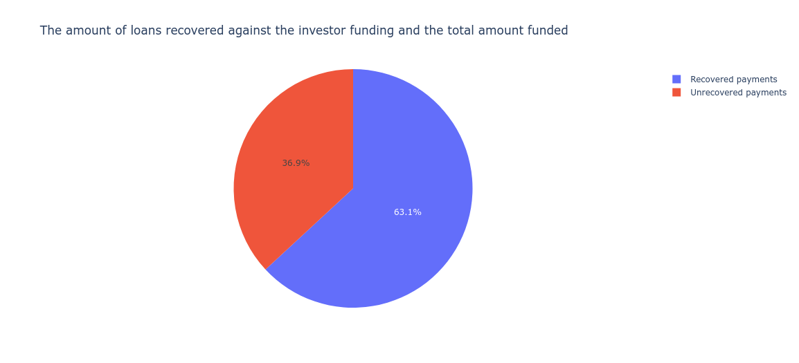
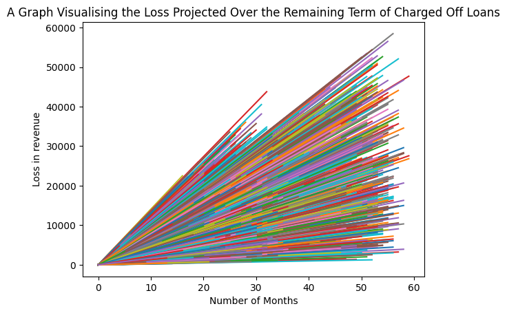

# exploratory-data-analysis---customer-loans-in-finance103

exploratory-data-analysis---customer-loans-in-finance103 is a tool that allows financial institutions to analyse the loan data to make more informed decisions about loan approvals, pricing, and risk management as well as gain a deeper understanding of the risk and return associated with these loans.
## Table of contents

- [Installation](#installation)
- [Usage](#usage)
- [File Structure](#file-structure)
- [Contributing](#contributing)
- [License Information](#license-information)

## Installation
- Clone the repository 
```https://github.com/lhytsang/exploratory-data-analysis---customer-loans-in-finance103.git```
- Go to the root directory and install its dependencies using the command 

```bash
pip install -r requirements.txt
```
## Usage
All figures that can be printed and plotted are preceded by a comment describing the figure and what it shows as shown below:
```python
recovered_payments = unrecovered_payments = 0

for element in new_database['out_prncp']:
    if element > 0:
        unrecovered_payments += 1
    else:
        recovered_payments += 1

### Plotting a pie chart of the amount of recovered and unrecovered loans

df_plot.plot_pie([unrecovered_payments, recovered_payments], ['Unrecovered payments', 'Recovered payments'], 'The amount of loans recovered against the investor funding and the total amount funded')
```


The graphs plotted can also be more detailed like the one below showing the losses in revenue projected over the remaining terms if loans that had been charged off would have finished their term:

## File Structure
```
├── credentials.yaml
├── db_utils.ipynb
├── db_utils.py
├── LICENSE
├── new_file.csv
├── projected_losses.png
├── __pycache__
│   └── db_utils.cpython-311.pyc
├── README.md
├── recovered_vs_unrecovered_payments_pieplot.png
└── requirements.txt
```

## Contributing 

To contribute to exploratory-data-analysis---customer-loans-in-finance103, follow these steps:

1. Fork this repository.
2. Create a feature branch: `git checkout -b feature/NewFeature`.
3. Make your changes and commit them: `git commit -m 'Add feature'`
4. Push to the original branch: `git push origin feature/NewFeature`
5. Create the pull request.

Alternatively see the GitHub documentation on [creating a pull request](https://help.github.com/en/github/collaborating-with-issues-and-pull-requests/creating-a-pull-request).


## License Information
Distributed under the MIT License. See LICENSE for more information.
[](https://opensource.org/licenses/MIT)